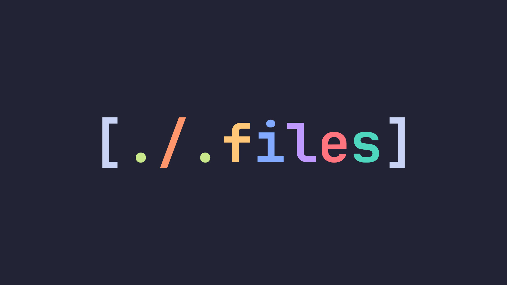

## Hello
Here you'll find my dotfiles, and a detailled description for each of them. I hope you'll like them!

> Note: Using them means you know how to manage them. So you can open issues but please, read documentation before complaining.
> Also, dont forget to read the manpages. [Arch manpages](https://man.archlinux.org)

> Note: I'll add images, I promise

> IMPORTANT: Use Nvim, not Emacs, because Nvim is way better. In short, be smart, use nvim.

## :computer: Eww \[WIP\]

A [topbar](./eww) made with Eww. It was made for my (small) laptop, so feel free to adapt it to your screen. Note that it was made for wayland, so you must made some changes to make it work on X11.

### Requirements

- Eww built with wayland support
- Mpc & PlayerCTL for the mini player
> I'll make it 100% mpc dependant (or 100% PlayerCTL dependant), otherwise it's pretty dumb imo

### Useful infos

> The weather widget needs you to have a OpenWeatherMap account (for access to the API). Create one [here](https://home.openweathermap.org/users/sign_up).  
Also you'll need your latitude and longitude: get them [here](https://www.latlong.net/)

**Documentation:** [Eww official documentation](https://elkowar.github.io/eww/eww.html) - [dharmx powermenu tutorial](https://dharmx.is-a.dev/eww-powermenu/)

### TODO

- Finish this bar lmao
- A Eww powermenu

## :star: Hyprland config

A [Hyprland config](./hypr) using the [Nord colorscheme](https://www.nordtheme.com/). Don't forget to check the `hypr/hyprbinds` file to know all binds (if fact it's way better to check all files, but at least you must know the binds since without them you'll not be able to use this config).

### Requirements

- The latest Hyprland (in fact you can use an older hyprland, but you'll probably lack some functionnalities)
- Kitty (you don't ABSOLUTELY need it but it's a default terminal for this config, so it's useful)
- All other stuff required by the bindings which launch apps (firefox,thunar, webcord) but feel free to change them

### Useful infos
> Most important bindings (if you're absolutely lost): `Super+Return` opens Kitty; `Super+Q` closes Hyprland.

## :notes: Mpd & Ncmpcpp

The Mpd config and Ncmpcpp config works together. I mean, you can use the Mpd config with another client, there's no problem, but this Mpd config was made for Ncmpcpp. That's all.

### Requirements

- Mpd
- Ncmpcpp

### Useful infos

> **Warning**
> You'll need to use a [nerd font](https://www.nerdfonts.com/) (i recommend the jetbrains mono nerdfont) to have the icons working

> By default, there's a fifo output (for the Ncmpcpp visualizer), a pipewire output, and a pulseaudio output. Feel free to add or remove some of them. 
This config addionaly requires you to create the `~/.mpd` directory, and to create a file named `database` inside. You can choose other names, but in this case you'll must change the config options to these new locations/filenames. 
This suposes that your music folder is `~/Music`. Don't forget to change it needed.

**Documentation:** [Mpd Archwiki](https://wiki.archlinux.org/title/Music_Player_Daemon) - [Mpd Archwiki tips](https://wiki.archlinux.org/title/Music_Player_Daemon/Tips_and_tricks) - [Mpd Archwiki troubleshooting](https://wiki.archlinux.org/title/Music_Player_Daemon/Troubleshooting) - [Ncmpcpp archwiki](https://wiki.archlinux.org/title/Ncmpcpp)

## :keyboard: Neovim

A complete configuration for [The One True Text Editor](https://neovim.io/)! It uses [lazy.nvim](https://github.com/folke/lazy.nvim) (and lazy loads a lot), and a bunch of plugins to give you an awesome neovim experience! I use Nvim as my main text editor, so be sure to find a configuration meant to be cool and useful!

### Requirements
- Neovim nightly
- Linux (in fact it may work with windows but i really don't know)

### Useful infos
> Most of the plugins comme from [awesome-neovim](https://github.com/rockerBOO/awesome-neovim) list.

**Documentation**: [Neovim docs](https://neovim.io/doc/)

## :telescope: Rofi

Currently, theres two rofi configurations: One with [nord](https://www.nordtheme.com/) color palette (first one), and one with [tokyonight](https://github.com/folke/tokyonight.nvim) color palette (newer). They are very different: that's wanted. In the first config I just did a "basic" config, I mean I didn't tried to be imaginative, I just did something meant to be simple and useful. In the newer one (idk if it's better), I tried to use other options. I really wanted to not repeat myself. I hope you'll like at least one of them!

### Requirements
- Common to the two configs:
    - [Phosphor Icons 2.0](https://phosphoricons.com/) (as icons font)
    - [Rofi wayland](https://github.com/lbonn/rofi) (or you'll must change some minor things)
- Nord:
    - [Zafiro Icons](https://github.com/zayronxio/Zafiro-icons) (for the icons)
    - [JetBrains Mono](https://www.jetbrains.com/lp/mono/) (as text font)
- Tokyonight    
    - [Papirus](https://github.com/PapirusDevelopmentTeam/papirus-icon-theme) (for the icons)
    - [Inter](https://rsms.me/inter/) (as font)

### Useful infos

**Documentation:** [Rofi wayland](https://github.com/lbonn/rofi) - [Rofi](https://github.com/davatorium/rofi)

